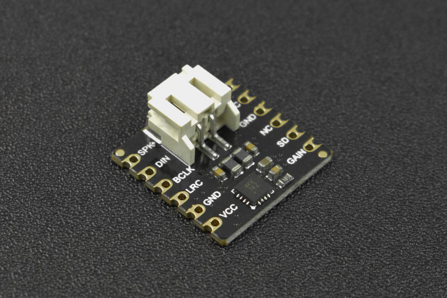

# DFRobot_MAX98357A
* [中文版](./README_CN.md)

This is a small and easy-to-use MAX98357A I2S amplifier. In combination with ESP32 controller, it can be turned into a Bluetooth speaker, WiFi walkie-talkie and device for voice recognition or network broadcast, etc. Insert an SD card into the module, then you can directly use it to play music. 





## Product Link (https://www.dfrobot.com/product-2614.html)
    SKU: DFR0954


## Table of Contents

* [Summary](#summary)
* [Installation](#installation)
* [Methods](#methods)
* [Compatibility](#compatibility)
* [History](#history)
* [Credits](#credits)


## Summary

* Support direct insertion and surface mount, small and easy-to-use.
* With onboard I2S amplifier, 3W power, and good sound quality.


## Installation

To use this library, first download the library file, paste it into the \Arduino\libraries directory, then open the examples folder and run the demo in the folder.


## Methods

```C++

  /**
   * @fn begin
   * @brief Init function
   * @param btName - Created Bluetooth device name
   * @param bclk - I2S communication pin number, serial clock (SCK), aka bit clock (BCK)
   * @param lrclk - I2S communication pin number, word select (WS), i.e. command (channel) select, used to switch between left and right channel data
   * @param din - I2S communication pin number, serial data signal (SD), used to transmit audio data in two's complement format
   * @return true on success, false on error
   */
  bool begin(const char *btName="bluetoothAmplifier", 
             int bclk=GPIO_NUM_25, 
             int lrclk=GPIO_NUM_26, 
             int din=GPIO_NUM_27);

  /**
   * @fn initI2S
   * @brief Initialize I2S
   * @param _bclk - I2S communication pin number, serial clock (SCK), aka bit clock (BCK)
   * @param _lrclk - I2S communication pin number, word select (WS), i.e. command (channel) select, used to switch between left and right channel data
   * @param _din - I2S communication pin number, serial data signal (SD), used to transmit audio data in two's complement format
   * @return true on success, false on error
   */
  bool initI2S(int _bclk, int _lrclk, int _din);

  /**
   * @fn initBluetooth
   * @brief Initialize bluetooth
   * @param _btName - The created Bluetooth device name
   * @return true on success, false on error
   */
  bool initBluetooth(const char * _btName);

  /**
   * @fn initSDCard
   * @brief Initialize SD card
   * @param csPin The number of the cs pin for spi communication of SD card module
   * @return true on success, false on error
   */
  bool initSDCard(uint8_t csPin=GPIO_NUM_5);

/*************************** Function ******************************/

  /**
   * @fn scanSDMusic
   * @brief Scan the music files in WAV format in the SD card
   * @param musicList - The music files in WAV format scanned from the SD card. Type: character string array.
   * @return None
   * @note Only support English for path name of music files and WAV for their format currently.
   */
  void scanSDMusic(String * musicList);

  /**
   * @fn playSDMusic
   * @brief Play music files in the SD card
   * @param Filename - music file name, only support the music files in .wav format currently
   * @note Music file name must be an absolute path like /musicDir/music.wav
   * @return None
   * @note Only support English for path name of music files and WAV for their format currently.
   */
  void playSDMusic(const char *Filename);

  /**
   * @fn SDPlayerControl
   * @brief SD card music playback control interface
   * @param CMD - playback control command: 
   * @n SD_AMPLIFIER_PLAY: start to play music, which can be played from the position where you paused before
   * @n   If no music file is selected through playSDMusic(), the first one in the playlist will be played by default.
   * @n   Playback error may occur if music files are not scanned from SD card in the correct format (only support English for path name of music files and WAV for their format currently)
   * @n SD_AMPLIFIER_PAUSE: pause playback, retain the playback position of the current music file
   * @n SD_AMPLIFIER_STOP: stop playback, end the current music playback
   * @return None
   */
  void SDPlayerControl(uint8_t CMD);

  /**
   * @fn getMetadata
   * @brief Get "metadata" through AVRC command
   * @param type - The type of metadata to be obtained, and the parameters currently supported: 
   * @n     ESP_AVRC_MD_ATTR_TITLE   ESP_AVRC_MD_ATTR_ARTIST   ESP_AVRC_MD_ATTR_ALBUM
   * @return The corresponding type of "metadata"
   */
  String getMetadata(uint8_t type);

  /**
   * @fn getRemoteAddress
   * @brief Get address of Bluetooth device remotely
   * @note The address will be obtained after the module is paired with the remote Bluetooth device and successfully communicates with it based on the Bluetooth AVRCP protocol.
   * @return Return the array pointer storing the address of the remote Bluetooth device
   * @n Return None when the module does not connect to the remote device or failed to communicate with it based on the Bluetooth AVRCP protocol.
   * @n AVRCP(Audio Video Remote Control Profile)
   */
  uint8_t * getRemoteAddress(void);

  /**
   * @fn setVolume
   * @brief Set volume
   * @param vol - Set volume, the range can be set to 0-9
   * @note 5 for the original volume of audio data, no increase or decrease
   * @return None
   */
  void setVolume(float vol);

  /**
   * @fn openFilter
   * @brief Enable audio filter
   * @param type - bq_type_highpass: enable high-pass filtering; bq_type_lowpass: enable low-pass filtering
   * @param fc - Threshold of filtering, range: 2-20000
   * @note For example, setting high-pass filter mode and the threshold of 500 indicates to filter out the audio signal below 500; high-pass filter and low-pass filter will work simultaneously.
   * @return None
   */
  void openFilter(int type, float fc);

  /**
   * @fn closeFilter
   * @brief Disable the audio filter
   * @return None
   */
  void closeFilter(void);

  /**
   * @fn reverseLeftRightChannels
   * @brief Reverse left and right channels, When you find that the left
   * @n  and right channels play opposite, you can call this interface to adjust
   * @return None
   */
  void reverseLeftRightChannels(void);

```


## Compatibility

MCU                | Work Well    | Work Wrong   | Untested    | Remarks
------------------ | :----------: | :----------: | :---------: | :----:
FireBeetle-ESP32   |      √       |              |             |


## History

- 2022/02/07 - Version 1.0.0 released.
- 2022/09/21 - Version 1.0.1 released.


## Credits

Written by qsjhyy(yihuan.huang@dfrobot.com), 2022. (Welcome to our [website](https://www.dfrobot.com/))

